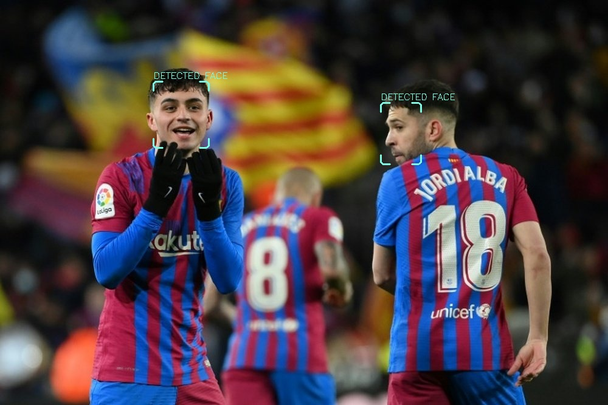

# Face extractor
An AI tool that detects and extracts visible and partially visible faces from images.
- Extracts and saves detected faces to the **faces** folder.
- draws a box around all detected faces and saves a copy of the original image in the **results** folder.
- you can run the script on one or multiple images at once.

#### Input image

#### Detected faces

#### Extracted faces
 


## Installation
```
git clone https://github.com/rykerdz/face_extractor
cd face_extractor
pip install -r requirements.txt
```

## Usage
1. Move your images to the **images** folder.
2. run ```python face_extractor.py```

*After running the script you should find your results in the **results** and **faces** folders*

## Used Libaries
- OpenCV
- numpy


